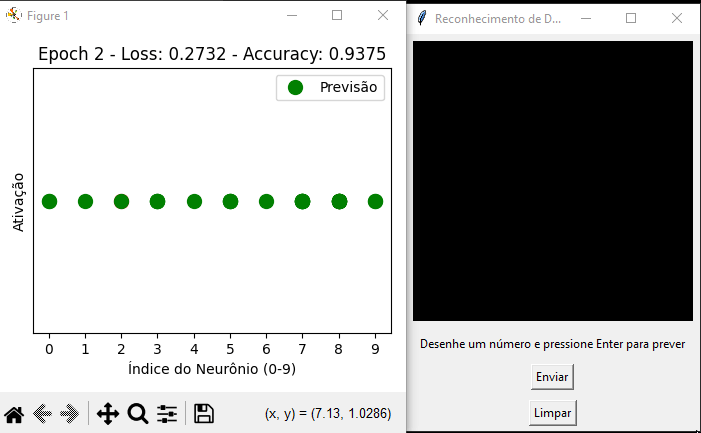

# Digit Identifier through Neural Network

This package contains an implementation of a neural network designed to recognize digits drawn by the user. The library allows you to experiment with different weight initialization techniques, activation functions, and hyperparameters, enabling you to tailor the network to your needs. Furthermore, you can easily adapt it for broader problems, such as image classification (e.g., cat vs. dog).

<div style="text-align: center;">
  
</div>


### Features
- **Digit Recognition**: Identify digits drawn by the user.
- **Customization**: Choose from various weight initializations and activation functions.
- **Experimentation**: Adjust parameters like the number of hidden layers, network size, learning rate, and regularization.
- **Versatility**: Adapt the network to recognize other patterns, such as images of cats and dogs.
- **Training Insights**: Visualize the training progress with real-time graphs showing the loss and accuracy over epochs.

## Quick Start
To quickly get started with the application, follow the steps below:

### Installation
Clone the repository and install the required dependencies:

```bash
git clone https://github.com/lcmialichi/neural-network
cd neural-network
pip install -r requirements.txt
```

### Download the Dataset
To train the model, you will need the MNIST dataset in CSV format. Follow the steps below to download it:
 1. Visit the [dataset MNIST in CSV on Kaggle](https://www.kaggle.com/datasets/oddrationale/mnist-in-csv).
 2. Click the "Download" button to get the compressed file containing the dataset.
 3. Extract the contents of the file and place the CSV files in the ``data/`` folder inside your project directory.

Alternatively, to automate the process, run the following command to download the dataset directly to the ``data/`` folder (make sure you have the Kaggle library installed and configured):

```bash
kaggle datasets download -d oddrationale/mnist-in-csv -p ./data
```
Once the dataset is downloaded, you can proceed to train the model.

## Run the Application
To run the application and start experimenting with the neural network, execute the command:

```bash
python main.py
```
The application will start, and you can draw numbers on the panel for the neural network to predict which number was drawn. You can also train the network with new data!

## Customization
You can customize various parameters, such as the number of hidden layers, the activation function, weight initialization, and more. Here's an example for quick adjustments:

```python
model = Neuron({
    'input_size': 784, 
    'hidden_size': 256, 
    'output_size': 10, 
    'layers_number': 4,
    'learning_rate': 0.001,
    'regularization_lambda': 0.0001
}, He())

model.set_activation(Relu())
```

### Initializations
Weight initialization is a crucial aspect for the efficiency of neural network training. The package offers several initialization options, including:

- **He (Kaiming) Initialization**: Ideal for networks using the ReLU activation function.
- **Xavier Initialization**: Suitable for activation functions like sigmoid and tanh.
- **Custom Initialization**: You can define your own initialization strategy by passing it as an argument to the constructor.

### Activation Functions
The activation function is fundamental for introducing non-linearity into the neural network. The package includes several activation functions, such as:

- **ReLU (Rectified Linear Unit)**: One of the most popular activation functions due to its simplicity and efficiency.
- **Leaky ReLU**: A variation of ReLU that solves the vanishing gradient problem by allowing a small negative value for inputs smaller than zero.

- **Sigmoid**: A classical activation function that maps values to the range [0, 1]


### Training
After configuring your network and downloading the dataset, you can train the model with the provided data. Training is done via the train method, and you can configure the number of epochs, batch size, and even the result plotting function:

```python
app.train("mnist_train.csv", epochs=20, batch_size=32, plot=Chart().plot_activations)
```

## Features
- **Digit Recognition**: Identify digits drawn by the user.
- **Customization**: Choose from different initializations and activation functions.
- **Experiments**: Adjust parameters like the number of hidden layers, network size, and learning rate.
- **Versatility**: Adapt the network to recognize other patterns, such as images of cats and dogs.