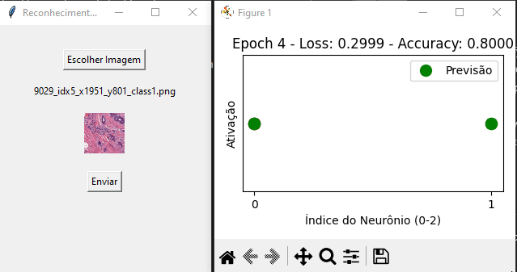

# Breast Cancer Detection through Convolutional Neural Network

This package contains an implementation of a convolutional neural network (CNN) designed to detect breast cancer in histopathology images. The library allows you to experiment with different configurations, including weight initialization techniques, activation functions, dropout, and hyperparameters, enabling customization to meet your specific needs. Additionally, the network is adaptable to other image classification problems.

<p align="center">
  
</p>

### Features
- **Breast Cancer Detection**:  Analyze histopathology images to identify cancerous cells.
- **Customization**: Configure the CNN with various weight initialization techniques, activation functions, and hyperparameters.
- **Experimentation**: Fine-tune parameters such as hidden layer size, learning rate, dropout, and stride

- **Versatility**:  Adapt the network to classify other image types and categories.
- **Training Insights**: Visualize the training process with real-time graphs showing loss and accuracy across epochs

## Quick Start
To quickly get started with the application, follow the steps below:

### Installation
Clone the repository and install the required dependencies:

```bash
git clone https://github.com/lcmialichi/neural-network
cd neural-network
pip install -r requirements.txt
```

### Download the Dataset
To train the model for breast cancer detection, download the histopathology image dataset from Kaggle:

```bash
kaggle datasets download -d paultimothymooney/breast-histopathology-images -p ./data
```
 histopathology image dataset from Kaggle:  
1. Visit the [Breast Histopathology Images dataset on Kaggle.](https://www.kaggle.com/datasets/paultimothymooney/breast-histopathology-images/data)

2. Click the "Download" button to get the images.
3. Extract the dataset and place the images into the ``data/`` folder, ensuring that the images are organized according to the categories (e.g., malignant and benign).


Once the dataset is downloaded, you can proceed to train the model.

## Run the Application
```bash
python main.py
```
or

```bash
python main.py --mode validate
```
The application will run with an input file for model prediction.

###  Command Line Arguments:

**See all commands:**
```bash
python main.py --help
```

**Train model:**
```bash
python main.py --mode train
```

**Train model with new cache file:**
```bash
python main.py --mode train --clear-cache
```

**Train model with no cache update and a new initialization:**
```bash
python main.py --mode train --no-cache
```

**Shows training statistics as a plot:**
```bash
python main.py --mode train --plot
```

**Test model**
```bash
python main.py --mode test --plot
```

## Configuration Example
Below is an example of configuring the network wioth resnet custom blocks:

```python
import neural_network.supply as attr

from neural_network import Config
from neural_network.core.padding import Padding
from custom.residual_block import ResidualBlock

 config = Config({
        'input_shape': (IMAGE_CHANNELS, *IMAGE_SIZE),
        'regularization_lambda': 1e-4,
    })

    config.set_processor(
        ImageProcessor(
            base_dir="./data/breast-histopathology-images",
            image_size=IMAGE_SIZE,
            batch_size=BATCH_SIZE,
            split_ratios=(0.7, 0.15, 0.15),
            shuffle=True,
            augmentation=True
        )
    )

    config.driver('gpu')
    config.set_global_optimizer(attr.Adam(learning_rate=0.001))
    config.with_cache(path='./data/cache/model.pkl')
    config.padding_type(Padding.SAME)
    config.loss_function(attr.CrossEntropyLoss())

    kernel1 = config.add_kernel(number=64, shape=(7, 7), stride=2)
    kernel1.initializer(attr.He())
    kernel1.activation(attr.Relu())
    kernel1.batch_normalization()
    kernel1.max_pooling(shape=(2, 2), stride=2)

    # **ResNet**
    config.add_custom(ResidualBlock(number=64, shape=(3, 3), stride=1, downsample=True))
    config.add_custom(ResidualBlock(number=128, shape=(3, 3), stride=2, downsample=True))
    config.add_custom(ResidualBlock(number=256, shape=(3, 3), stride=1, downsample=True))
    config.add_custom(ResidualBlock(number=512, shape=(3, 3), stride=2, downsample=True))

    # **Flatten**
    config.flatten()
    dense = config.dense()

    # **Fully Connected Layers**
    layer2 = dense.add_layer(size=512, dropout=0.5)
    layer2.initializer(attr.He())
    layer2.activation(attr.Relu())

    layer3 = dense.add_layer(size=256, dropout=0.5)
    layer3.initializer(attr.He())
    layer3.activation(attr.Relu())

    # output
    output = dense.add_layer(size=2)
    output.activation(attr.Softmax())
    output.initializer(attr.Xavier())

    return config
```


### Initializations
Weight initialization is a crucial aspect for the efficiency of neural network training. The package offers several initialization options, including:

- **He (Kaiming) Initialization**: Ideal for networks using the ReLU activation function.
- **Xavier Initialization**: Suitable for activation functions like sigmoid and tanh.
- **Custom Initialization**: You can define your own initialization strategy by passing it as an argument to the constructor.

### Activation Functions
The activation function is fundamental for introducing non-linearity into the neural network. The package includes several activation functions, such as:

- **ReLU (Rectified Linear Unit)**: One of the most popular activation functions due to its simplicity and efficiency.
- **Leaky ReLU**: A variation of ReLU that solves the vanishing gradient problem by allowing a small negative value for inputs smaller than zero.

- **Sigmoid**: A classical activation function that maps values to the range [0, 1]

### Dropout
Dropout is a regularization technique used to prevent overfitting by randomly "dropping" neurons during training. You can set a dropout rate (e.g., 0.2 means 20% of the neurons are dropped) in the model's configuration.

### Optimizer
The package uses Adam (Adaptive Moment Estimation) as the default optimizer for training the neural network. Adam combines the benefits of two popular optimizers: RMSProp and Stochastic Gradient Descent (SGD) with momentum. Its main advantages include adaptive learning rates for each parameter and faster convergence in practice.

### Max pooling
Max pooling is a down-sampling operation used in convolutional neural networks to reduce the spatial dimensions (width and height) of feature maps while retaining the most important information. The operation slides a window (e.g., 2x2) over the feature map and retains the maximum value within that window.

### Convolution
Convolution is the core operation of a convolutional neural network, designed to detect patterns and features in images, such as edges, textures, and shapes. A convolutional layer applies filters (or kernels) to the input image to generate feature maps

### Training
After configuring your network and downloading the dataset, you can train the model with the provided data. Training is done via the ``train`` method, and you can configure the number of epochs, batch size, and even the result plotting function:

```python
app.model().set_training_mode()
app.model().get_trainer().train(epochs=10)
```

## Features
- **Breast Cancer Detection**: Analyze histopathology images to detect breast cancer.
- **Customization**: Choose from different initializations and activation functions.
- **Experiments**: Adjust parameters like the number of hidden layers, network size, and learning rate.
- **Versatility**: Adapt the network to recognize other patterns, such as images of cats and dogs.